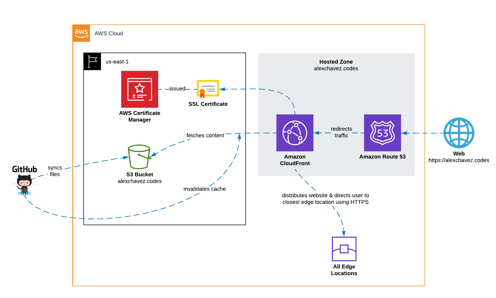

# alexchavez.codes
The personal website of Alex Chavez. All serverless. Built on AWS.

## Website Architecture

Below architecture diagram shows how S3/CloudFront hosts this site via HTTPS:

## Deployment

### First Time Deployment of Site

I originally provisioned and configured the services needed for my site using the AWS Console. I ended up creating a CloudFormation (not to be confused with **CloudFront** btw) template using [CloudFormer](https://docs.aws.amazon.com/AWSCloudFormation/latest/UserGuide/cfn-using-cloudformer.html) after the fact. You'll want to modify the CloudFormation template under `infra/cloudformation.json` if you would like to autonomously provision needed AWS infrastructure using CloudFormation.

At the time of writing, CloudFormation doesn't support AWS Certificate Manager so you'll have to create your own SSL certificate using the AWS Console. In addition, I had to configure my domain's DNS records on Namecheap to point to Route53. Buying your domain through Route53 will save you a couple of steps.

### Updating the Site

Push or approve PR changes into the **master** branch. Github Actions defined in `.github/workflows/pipeline.yml` will sync contents from `dist/` to the S3 bucket then send a request to CloudFormation to invalidate its cache in order to globally propogate site changes.

## Site Frontend Development

Checkout repo and install dependencies from `package.json`:

    npm install

Build project:

    npm run build

Live Reloading with webpack-dev-server:

    npm start

You can now instantly view any saved changes in [http://localhost:8080/](http://localhost:8080/)!